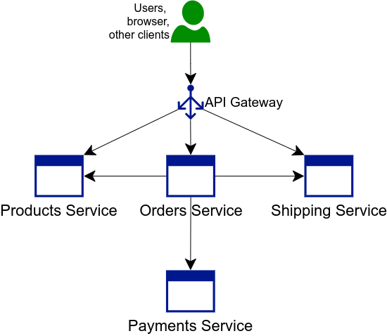
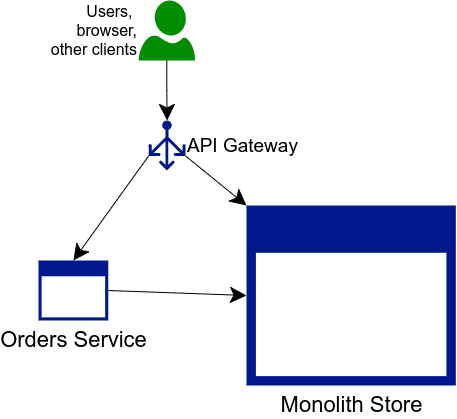
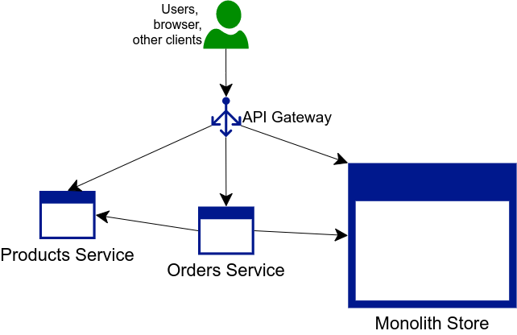
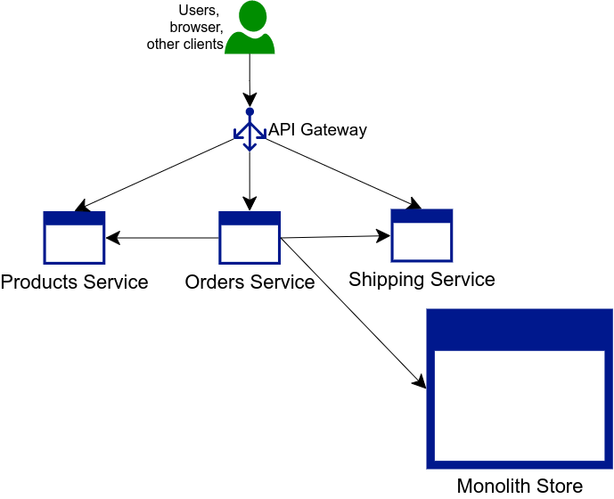
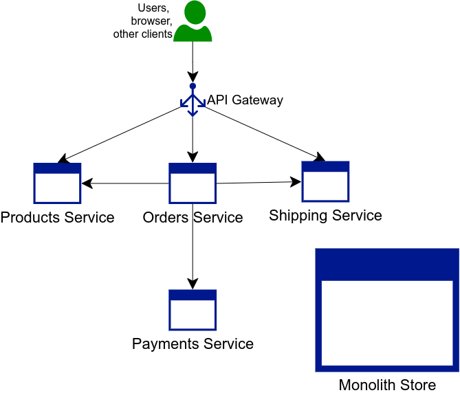

# Introducción

En este práctico realizaremos una simulación de migración de un sistema bajo una arquitectura monolítica a una arquitectura de microservicios.

Se provee el código y el mismo ya empaquetado para utilizar en la práctica.
El mismo es sobre un sistema de ejemplo y demostración, por lo que es totalmente básico. 
Las funcionalidades utilizan información estática y sirven simplemente para interactuar con el sistema y que los componentes interactúen entre sí.

En este trabajo comenzaremos desplegando la aplicación monolítica y paso a paso iremos agregando los microservicios hasta que en el final podremos apagar el monolito manteniendo las funcionalidades.

## Descripción de la aplicación

El sistema es una simulación de un sistema de compra y envío de productos.
Las funcionalidades son simplemente:
- Obtener los productos.
- Obtener información de un producto en particular.
- Realizar una compra.
- Ver el estado de un envío.

Estas se acceden mediante invocaciones HTTP.

Como podran notar, son funcionalidades que no tienen mucha relación pero se encuentran acopladas en una sola aplicación.

Como se mencionó anteriormente, las funcionalidades utilizan información estática, no hay ningún tipo de base de datos o sistema de almacenamiento.

## Pre-requisitos

En esta guía trabajaremos con Docker para el despliegue de los contenedores.
Se asume que tienen la herramienta instalada de trabajos anteriores.

Para invocar a las APIs HTTP utilizaremos Postman (https://www.postman.com/downloads/), pero se podrían utilizar otras herramientas.

# Desplegando la aplicación en su arquitectura monolítica

## Iniciando el monolito

### Crear la imagen del contenedor

Lo primero que debemos hacer es crear la imágen Docker de nuestro monolito de ejemplo.
Normalmente los monolitos no se encuentran en contenedores, pero en este caso para simplificar el ejericio, colocaremos el monolito en un contenedor para que no sea necesario instalar ninguna dependencia.

Para construir la imagen del contenedor necesitaremos 2 archivos:
- monolith-store-example.jar - El empaquetado de la aplicación monolítica. Si bien el código de la aplicación se encuentra en el directorio, para simplificar el proceso se incluye el jar armado.
- Dockerfile - El archivo con la especificación para crear la imagen del contenedor.

Estando ubicados en el directorio monolith-store-example, donde se encuentran esos dos archivos, podremos ejecutar lo siguiente para crear la imagen:

```console
docker build --build-arg JAR_FILE=monolith-store-example.jar -t monolith-store-example:1 .
```

Si todo salió bien, ejecutando "docker images" deberemos encontrar la nueva imagen.

### Crear y ejecutar el contenedor

Para crear y correr el contenedor deberemos ejecutar:
```console
docker run -d --name monolith-store-example monolith-store-example:1
```

Lo que hicimos fue crear un contenedor con nombre "monolith-store-example", utilizando la imagen "monolith-store-example:1" y con el parámetro "-d" para que ejecute desatachado del proceso de la terminal.

Para ver los contenedores en ejecución podemos ejecutar:
```console
docker ps
```

Y para ver los logs de un contenedor:

```console
docker logs monolith-store-example
```

### Obtener la IP del monolito

Deberemos obtener la IP del contenedor para poder invocar las funcionalidades.

Para obtener esta IP podemos ejecutar:

```console
docker inspect monolith-store-example
```

Sobre el final de la salida se encuentra la propiedad IPAddress con la IP del contenedor.

Se deberá anotar esta  IP porque se utilizará más adelante.

## Iniciar el API Gateway

Para tener un único punto de acceso, adelantándonos a la arquitectura de microservicios, desplegamos un API Gateway delante del monolito.

Como API Gateway utilizaremos nginx (https://www.nginx.com/).

### Descarga de la imagen del contenedor
Primero descarguemos la imagen del contenedor:
```console
docker pull nginx:1.21
```
Se toma la versión 1.21 del contenedor siendo la última estable en el momento, pero se podría utilizar otra.

### Configuración

Se incluye una configuración básica para nginx. La misma se encuentra en el directorio nginx-conf de la práctica.
Allí deberán modificar en el archivo api_gateway.conf el bloque:
```
upstream monolith {
    server 172.17.0.3:8080;
}
```
Cambiando la IP que allí se encuentra por la del monolito que se obtuvo previamente.

En ese archivo se podrá ver que las invocaciones a la API se redirigen al monolito.

### Creación y ejecución del contenedor

El contenedor lo ejecutaremos de manera similar al monolito, pero compartiremos un directorio para modificar la configuración desde nuestra máquina.
Esta configuración es la que se modificó en el paso anterior. Se incluye entonces un parámetro "-v" donde deberemos indicar el path completo al directorio y luego del caracter ":" el path a la configuración dentro del contenedor.

```console
docker run --name api-gateway -v $PATH_AL_DIRECTORIO/nginx-conf/:/etc/nginx/conf.d/ -d nginx:1.21
```

Verifiquemos que el contenedor se encuentre en ejecución:

```console
docker ps
```

### Obtener la IP del API Gateway

Deberemos obtener la IP del contenedor para poder invocar las funcionalidades.

Para obtener esta IP podemos ejecutar:

```console
docker inspect api-gateway
```

Sobre el final de la salida se encuentra la propiedad IPAddress con la IP del contenedor.

Se deberá anotar esta  IP porque se utilizará más adelante.

## Utilizando el monolito con Postman

Luego de haber levantado el monolito y el API Gateway, se podrá probar invocar las APIs.
Una opción para esto es utilizar Postman, para el cual se incliye una colección con las invocaciones HTTP preparadas.
Esta colección se encuentra en el direcotrio del laboratorio:
- MonolithToMicroservicesExample.postman_collection.json

Para utilizar Postman podrán descargarlo de: https://www.postman.com/downloads/

Una vez incluida la colección a Postman, es necesario actualizar la variable de la colección que se llama API_GATEWAY_IP con la IP del contenedor del API Gateway.

Para configurar la variable se deberá acceder a las propiedades de la colección en los tres puntos del nombre. Elegir la opción editar y dirigirse a la pestaña Variables.

Una vez configurada la variable, probar las invocaciones. Estas sirven para asegurarnos que el sistema va funcionando bien a medida que avanzamos con la práctica.

# Migración a la arquitectura de microservicios

Para definir la descomposición de las funcionalidades en los microservicios, podemos hacerlo por dominio o por área de negocio.
En este caso, analizando el código del monolito y las funcionalidades que expone, podemos identificar 4 dominios:
- Ordenes de compras
- Pagos
- Productos
- Envíos

Por esta razón la arquitectura que se plantea es con los siguientes 4 microservicios:
- Orders Service
- Payments Service
- Products Service
- Shipping Service

Siendo los 4 accedidos mediante un único punto de acceso utilizando el patrón API Gateway.



## Extrar el servicio de órdenes.

El primer servicio que se va a extraer en un microservicio es el de órdenes.
El objetivo de este paso es conseguir una arquitectura como la siguiente:



Notar que en este caso, el nuevo Orders Service deberá comunicarse con los módulos de productos, pagos y envíos que aún se encuentran en el monolíto.
En un caso más real, en este punto deberíamos modificar el monolito para que exponga estas funcionalidades, o de alguna manera se sincronice con los nuevos microservicios.
Claramente modificar el monolito es algo costo, una de las razones por las que queremos quitarlo y pasar a microservicios, por lo tanto debemos planificar bien para que los cambios sean mínimos.
En este ejemplo, para facilitar la vida del alumno, el monolito ya expone las funcionalidades necesarias para que el nuevo microservicio de órdenes pueda comunicarse.

El código y empaquetado jar de este nuevo microservicio se encuentra en el directorio orders-service-example.

### Crear la imagen el contenedor

De la misma forma que con el monolito, crearemos la imagen. Es necesario estar en el directorio orders-service-example ya que ahí se encuentran los archivos que necesitamos:
- orders-service-example.jar - Empaquetado del microservicio.
- Dockerfile - Especificación para armar la imagen del contenedor.

```console
docker build --build-arg JAR_FILE=orders-service-example.jar -t orders-service-example:1 .
```

### Creación y ejecución del contenedor

La diferencia de este contenedor con el del monolito, es que la aplicación necesita recibir por parámetro la URL del monolito para invocar las funcionalidades de pagos, productos y envíos.
Adelantando que más adelante estos serán 3 servicios distintos, la aplicación recibe 3 URLs.
En este caso las 3 van a ser iguales y tendrán que tener la IP del contenedor del monolito.

```console
docker run -d --name orders-service-example --env "APP_ARGS=http://172.17.0.2:8080 http://172.17.0.2:8080 http://172.17.0.2:8080" orders-service-example:1
```

### Configuración del API Gateway para utilizar el nuevo microservicio

En el archivo api_gateway.conf agregar al comienzo el siguiente bloque, cambiando la IP por la del contenedor del nuevo microservicio de ordenes:

```console
upstream orders {
    server 172.17.0.4:8080;
}
```

Con esto podemos indicar ahora el API Gateway que al momento de invocar /orders, se redireccione al contenedor del microservicio.
Para eso, en el mismo archivo de configuración reemplazaremos el bloque de "location /". Cambiaremos:
```console
location / {
    proxy_pass http://monolith/;
}
```
Por el siguiente:
```console
location /orders {
    proxy_pass http://orders/orders/;
}

location /products {
    proxy_pass http://monolith/products/;
}

location /shipping {
    proxy_pass http://monolith/shipping/;
}
```
De esta forma ya nos estamos adelantando a que van a existir diferentes servicios y redireccionamientos.
En este caso /orders apunta al nuevo microservicio, mientras que /products y /shipping apuntan al monolito.

Para que nginx tome la nueva configuración ejecutaremos lo siguiente:

```console
docker exec -ti api-gateway nginx -s reload
```

Eso lo que hizo fue ejecutar el comando "nginx -s reload" dentro del contenedor del API Gateway/

### Prueba

Para verificar vamos ejecutar la siguiente sentencia para ver los logs del contenedor del nuevo microservicio:
```console
docker logs -f orders-service-example
```

Y luego ejecutaremos desde Postman la invocación "Realizar una compra".

Lo que sucedió en este caso es que desde Postman volvimos a ejecutar la compra como en las pruebas anteriores, 
pero ahora el API Gateway invocó al nuevo microservicio en vez de al monolito. 

Además, dentro del microservicio se invocó a los servicios del monolito para pagos, productos y envíos.

## Extrar el servicio de productos

El segundo servicio que se va a extraer en un microservicio es el de productos.
El objetivo de este paso es conseguir una arquitectura como la siguiente:



El código y empaquetado jar de este nuevo microservicio se encuentra en el directorio products-service-example.

### Crear la imagen el contenedor

De la misma forma que con el microservicio anterior, crearemos la imagen. Es necesario estar en el directorio products-service-example ya que ahí se encuentran los archivos que necesitamos:
- products-service-example.jar - Empaquetado del microservicio.
- Dockerfile - Especificación para armar la imagen del contenedor.

```console
docker build --build-arg JAR_FILE=products-service-example.jar -t products-service-example:1 .
```

### Creación y ejecución del contenedor

A diferencia del microservicio anterior, el de productos no requiere parámetros de configuración ya que no se conecta con otros componentes.

```console
docker run -d --name products-service-example products-service-example:1
```

### Configuración del API Gateway para utilizar el nuevo microservicio

En el archivo api_gateway.conf agregar al comienzo el siguiente bloque, cambiando la IP por la del contenedor del nuevo microservicio de productos:

```console
upstream products {
    server 172.17.0.5:8080;
}
```

Con esto podemos indicar ahora el API Gateway que al momento de invocar /products, se redireccione al contenedor del microservicio.
Para eso, en el mismo archivo de configuración modificaremos el bloque:
```console
location /products {
    proxy_pass http://monolith/products/;
}

```
Por:
```console
location /products {
    proxy_pass http://products/products/;
}

```
En este caso /products ahora apunta al nuevo microservicio, mientras que /shipping continua apuntando al monolito.

Al igual que en el microservicio anterior, recargamos la configuración de nginx:

```console
docker exec -ti api-gateway nginx -s reload
```

### Reapuntar el servicio de ordenes al nuevo de productos

Ahora que tenemos el nuevo microservicio de productos, el de ordenes debería dejar de invocar al monolito por productos y comenzar a invocar al nuevo servicio.
Para eso vamos a recrear el contenedor del servicio de ordenes cambiando su variable de ambiente para poner la IP del microservicio de productos.

Para detener y borrar el contenedor:
```console
docker stop orders-service-example
docker rm -v orders-service-example
```

Para crearlo nuevamente, cambiando una de las URLs:
```console
docker run -d --name orders-service-example --env "APP_ARGS=http://172.17.0.2:8080 http://172.17.0.2:8080 http://172.17.0.5:8080" orders-service-example:1
```
El orden en los argumentos es pagos, envíos y productos. En este caso cambiamos la tercera.

### Prueba

Para verificar vamos ejecutar la siguiente sentencia para ver los logs del contenedor del nuevo microservicio:
```console
docker logs -f products-service-example
```

Y luego ejecutaremos desde Postman las invocaciones "Obtener productos", "Obtener un producto" y "Realizar una compra".

Lo que sucedió en este caso es que desde Postman volvimos a ejecutar la obtención de productos como en las pruebas anteriores, 
pero ahora el API Gateway invocó al nuevo microservicio en vez de al monolito.
En el caso de "Realizar una compra" se accedió al nuevo servicio a través del servicio de ordenes. 

## Extrar el servicio de envíos.

El tercer servicio que se va a extraer en un microservicio es el de envíos.
El objetivo de este paso es conseguir una arquitectura como la siguiente:



El código y empaquetado jar de este nuevo microservicio se encuentra en el directorio shipping-service-example.

### Crear la imagen el contenedor

De la misma forma que con el microservicio anterior, crearemos la imagen. Es necesario estar en el directorio shipping-service-example ya que ahí se encuentran los archivos que necesitamos:
- shipping-service-example.jar - Empaquetado del microservicio.
- Dockerfile - Especificación para armar la imagen del contenedor.

```console
docker build --build-arg JAR_FILE=shipping-service-example.jar -t shipping-service-example:1 .
```

### Creación y ejecución del contenedor

Al igual que el microservicio anterior, el de envíos no requiere parámetros de configuración ya que no se conecta con otros componentes.

```console
docker run -d --name shipping-service-example shipping-service-example:1
```

### Configuración del API Gateway para utilizar el nuevo microservicio

En el archivo api_gateway.conf agregar al comienzo el siguiente bloque, cambiando la IP por la del contenedor del nuevo microservicio de envíos:

```console
upstream shipping {
    server 172.17.0.6:8080;
}
```

Con esto podemos indicar ahora el API Gateway que al momento de invocar /shipping, se redireccione al contenedor del microservicio.
Para eso, en el mismo archivo de configuración modificaremos el bloque:
```console
location /shipping {
    proxy_pass http://monolith/shipping/;
}

```
Por:
```console
location /shipping {
    proxy_pass http://shipping/shipping/;
}

```
En este punto, ningún accesos externo a través del API Gateway accede al monolito.

Al igual que en el microservicio anterior, recargamos la configuración de nginx:

```console
docker exec -ti api-gateway nginx -s reload
```

### Reapuntar el servicio de ordenes al nuevo de envíos

Ahora que tenemos el nuevo microservicio de envíos, el de ordenes debería dejar de invocar al monolito por envíos y comenzar a invocar al nuevo servicio.
Para eso vamos a recrear el contenedor del servicio de ordenes cambiando su variable de ambiente para poner la IP del microservicio de envíos.

Para detener y borrar el contenedor:
```console
docker stop orders-service-example
docker rm -v orders-service-example
```

Para crearlo nuevamente, cambiando una de las URLs:
```console
docker run -d --name orders-service-example --env "APP_ARGS=http://172.17.0.2:8080 http://172.17.0.6:8080 http://172.17.0.5:8080" orders-service-example:1
```
El orden en los argumentos es pagos, envíos y productos. En este caso cambiamos la segunda.

### Prueba

Para verificar vamos ejecutar la siguiente sentencia para ver los logs del contenedor del nuevo microservicio:
```console
docker logs -f shipping-service-example
```

Y luego ejecutaremos desde Postman las invocaciones "Ver estado de envíos" y "Realizar una compra".

Lo que sucedió en este caso es que desde Postman volvimos a ejecutar la obtención del estado de un envío como en las pruebas anteriores, 
pero ahora el API Gateway invocó al nuevo microservicio en vez de al monolito.
En el caso de "Realizar una compra" se accedió al nuevo servicio a través del servicio de ordenes. 


## Extrar el servicio de pagos.
El cuarto y último servicio que se va a extraer en un microservicio es el de pagos.
El objetivo de este paso es conseguir una arquitectura como la siguiente:



El código y empaquetado jar de este nuevo microservicio se encuentra en el directorio payments-service-example.

### Crear la imagen el contenedor

De la misma forma que con el microservicio anterior, crearemos la imagen. Es necesario estar en el directorio payments-service-example ya que ahí se encuentran los archivos que necesitamos:
- payments-service-example.jar - Empaquetado del microservicio.
- Dockerfile - Especificación para armar la imagen del contenedor.

```console
docker build --build-arg JAR_FILE=payments-service-example.jar -t payments-service-example:1 .
```

### Creación y ejecución del contenedor

Al igual que el microservicio anterior, el de envíos no requiere parámetros de configuración ya que no se conecta con otros componentes.

```console
docker run -d --name payments-service-example payments-service-example:1
```

### ¿¿Configuración del API Gateway para utilizar el nuevo microservicio??

Este microservicio no es accedido desde el exterior, por lo que no se publica en el API Gateway.

### Reapuntar el servicio de ordenes al nuevo de pagos

Ahora que tenemos el nuevo microservicio de pagos, el de ordenes debería dejar de invocar al monolito por pagos y comenzar a invocar al nuevo servicio.
Para eso vamos a recrear el contenedor del servicio de ordenes cambiando su variable de ambiente para poner la IP del microservicio de pagos.

Para detener y borrar el contenedor:
```console
docker stop orders-service-example
docker rm -v orders-service-example
```

Para crearlo nuevamente, cambiando una de las URLs:
```console
docker run -d --name orders-service-example --env "APP_ARGS=http://172.17.0.7:8080 http://172.17.0.6:8080 http://172.17.0.5:8080" orders-service-example:1
```
El orden en los argumentos es pagos, envíos y productos. En este caso cambiamos el primero.

### Prueba

Para verificar vamos ejecutar la siguiente sentencia para ver los logs del contenedor del nuevo microservicio:
```console
docker logs -f payments-service-example
```

Y luego ejecutaremos desde Postman la invocación "Realizar una compra".
Lo que sucedió en este caso es que se accedió al nuevo servicio a través del servicio de ordenes. 

## Apagar el monolito.

En este punto ya podremos apagar el monolito y verificar que todo sigue funcionando correctamente.
```console
docker stop monolith-store-example
```
 